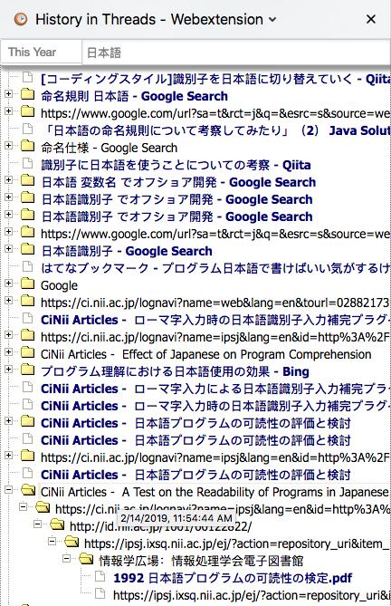

# HistoryInThreads_WebExtension
基于WebExtension的HistoryInThreads. 按主题显示浏览历史, 支持关键词搜索

演示:

## 开发笔记

运行参考[入门教程](https://developer.mozilla.org/en-US/Add-ons/WebExtensions/Your_first_WebExtension) about:debugging 中"临时载入组件"

用[web-ext](https://github.com/mozilla/web-ext)发布包命令, 在manifest.json所在目录中运行:

$ web-ext build --ignore-files="screenshot" README.md "*.komodoproject" "sidebar/test" --overwrite-dest
